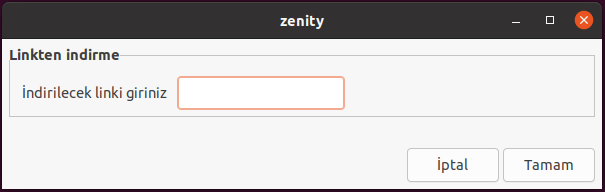
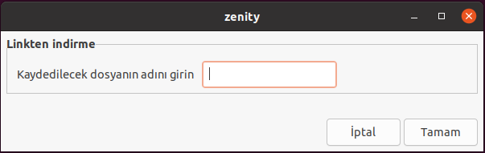
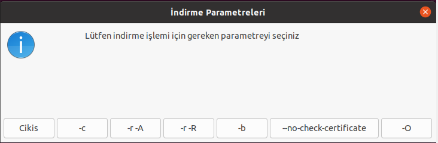
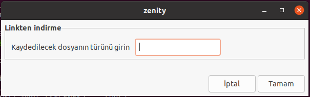
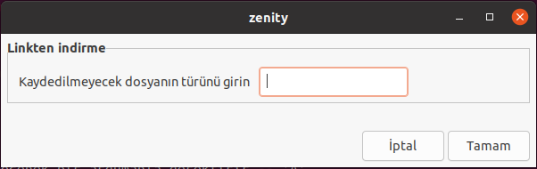

# wget-commands

<b>Bu projede Linux Shell'de <b>wget</b> komutunu ve bazı parametrelerini uyguladım.</b>

## Uygulamanın Amacı
Wget komudunu kullanarak verilen linkteki verileri parameterelere uygun şekilde indirmek. 

### Komutlar

#### -c

#### -r -A

#### -r -R

#### -b

#### --no-check-cercitificate

#### -O

### Kullanım
İlk olarak bir linux tabanlı sisteme ihtiyacımız var.
Bu sisteme last klasörünü indirdikten sonra shelle giriyoruz.

Shell'e    <b>bash last</b>   dedikten sonra hazırlanan GUI geliyor.

Gelen forma indirmek istediğimiz linki giriyoruz.

 

Ardından gelen formda indirilecek linki indirmek istediğimiz dosyanın adını giriyoruz.

 

Linkteki verileri indirmek için istediğimiz parametreyi seçiyoruz.

 

-r -A  veya  -r  -R  parametresini seçersek olmasını istediğimiz ya da olmamasını istediğimiz parametreyi giriyoruz.

 

## Nasıl Kurulur?

 
# 💻 Teknolojiler 

[Linkedin](https://www.linkedin.com/in/ahmet-mert-öz)

[E-posta](ahmetmertoz11@gmail.com)
